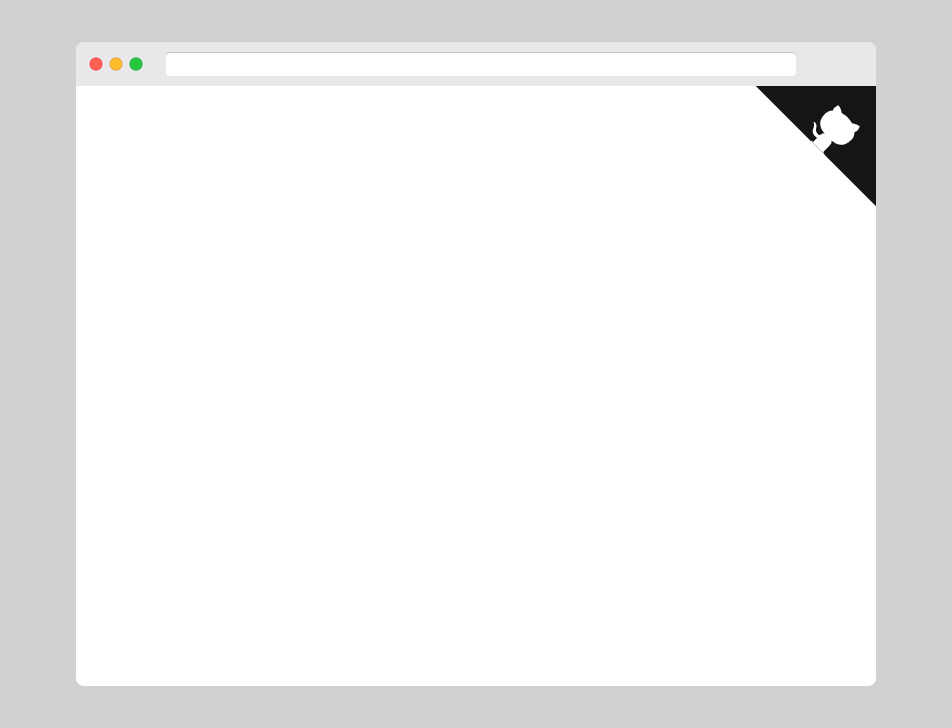

# Github Corners

This is my adaptation of the [tholman/github-corners](https://github.com/tholman/github-corners).

This repo only got two main file **[github_corner.js](./javascript/github_corner.js)**, and **[github_corner.ts](./typescript/src/ts/github_corner.ts)**, the rest of it is just for demo.

## Purpose

When using the original [tholman/github-corners](https://github.com/tholman/github-corners), it's a bit messy. So I pack it all into a single js/ts file.

## Usage

1. Copy the [github_corner.js](./javascript/github_corner.js)/ [github_corner.ts](./typescript/src/ts/github_corner.ts) file into your project.
2. Check the last few line of it, change the url to your url, and also set the color as you like.
3. Including the js/ts file in your `index.html`. (example for [javascript](./javascript/index.html) and [typescript](./typescript/src/index.html))
4. You got a Github Corners now!

## Additional

My adaptation also fix [the hit box problem](https://github.com/tholman/github-corners/issues/32) in [tholman/github-corners](https://github.com/tholman/github-corners).
